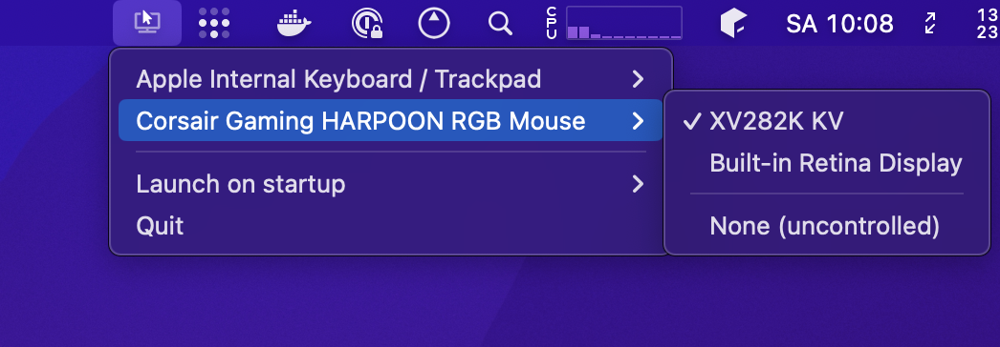
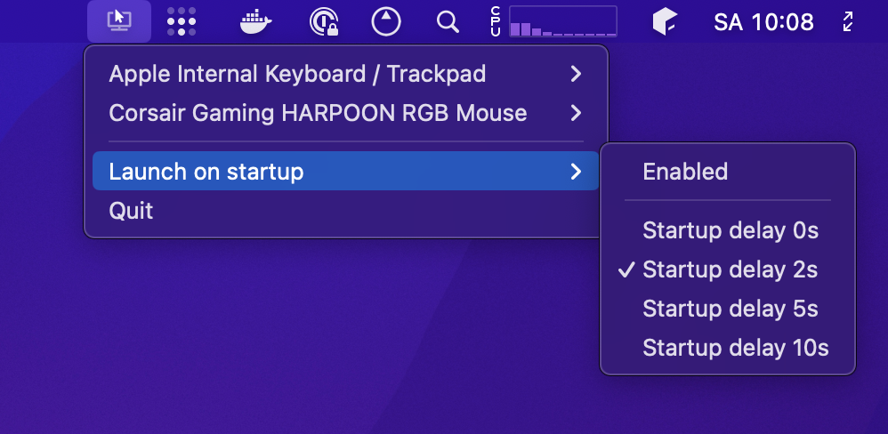

# DynaMouse


## Intro

Finally, a system for Mac that allows you to have multiple mice, multiple monitors and assign each to one another.
While Mac allows for multiple mice plugged-in at the same time, it doesn't allow multiple _cursors_ at the same time.

DynaMouse allows you to assign a specific display to a dedicated mouse device (including the built-in mac trackpads) so that when you have multiple screens in a studio-like/complex workstation setup (and far apart from each other), you don't have to drag your mouse over to the other screen.

**NEW in v1.2.0**: Added support for macOS Sonoma 14.3+ and Apple M3 Pro, plus touchscreen compatibility including ANMITE displays.

Behold:




When you first start DynaMouse and start configuring it, you will be asked to enable Accessibility permissions in System Preferences so that DynaMouse can monitor usb pointer devices and also control the mouse position on the screen. Dynamouse will wait for these permissions to be enabled before continuing to boot up :)

## Features

* Works as a system tray, doesn't appear in the dock
* Supports infinite monitors and pointer devices
* Assign multiple mice to the same monitor
* Configure specific mice to be uncontrolled (not governed by DynaMouse)
* Each mouse's position is remembered on each screen
* Non-obtrusive: doesn't lock the mouse to screen bounds, i.e. you can still drag a mouse to a different screen.
* Can be configured to launch on login.
* Can handle usb devices being attached / detached
* Specify a startup delay (useful when various devices are busy booting up after login)
* **NEW**: Touchscreen support including ANMITE displays
* **NEW**: macOS Sonoma 14.3+ compatibility
* **NEW**: Apple M3 Pro (ARM64) support

## System Requirements

* macOS Sonoma 14.3 or later
* Apple M1/M2/M3 Pro or Intel Mac
* Node.js 22.16.0 or later

## Touchscreen Support

DynaMouse now includes experimental support for touchscreen displays, with special detection for ANMITE touchscreens:

* Automatic detection of touchscreen displays
* ANMITE touchscreen identification
* Touch event monitoring (experimental)
* Individual touchscreen activation/deactivation
* Display information in system tray menu

### ANMITE Touchscreen Compatibility

ANMITE touchscreens are automatically detected and labeled in the system tray menu. The application can:
- Identify ANMITE displays specifically
- Monitor touch events (when drivers are properly installed)
- Provide display information and controls

**Note**: Full touchscreen functionality requires proper drivers to be installed on your system.

## Devices tested

The devices below have been tested and work:

* Corsair HARPOON RGB Gaming Mouse
* Corsair HARPOON Wireless RGB Gaming Mouse
* Apple magic trackpad (‎MMMP3AM/A)
* M1/M2/M3 Macbook trackpad
* **NEW**: ANMITE touchscreen displays (experimental)
* **NEW**: Generic touchscreen displays (experimental)

## Troubleshooting

* You can enable file logging which will log to `~/Library/Logs/@projectstorm/Dynamouse` (this can help with submitting an issue)
* Apple startup items seem use the exact binary at the time of installation, so if you are updating to a newer version, try disabling and re-enabling startup mode to install the newer version of the software
* You may need to remove and re-add Dynamouse accessibility permissions across versions (but I seem to no longer run into this after version 1.0.0)
* **For touchscreen issues**: Ensure proper drivers are installed for your touchscreen device
* **For Apple M3 Pro**: The app now includes ARM64 support, but you may need to rebuild native dependencies

## Installation Rapide

### Déploiement Automatique (Recommandé)

```bash
# Installation rapide et simple
./scripts/quick-deploy.sh

# Déploiement complet avec toutes les options
./scripts/deploy-macos.sh
```

### Installation Manuelle

1. `pnpm install`
2. `pnpm build`
3. `pnpm app:dist`

## Development

1. `pnpm install`
2. `pnpm watch`
3. `pnpm start`

### Building for Distribution

```bash
# Build for current platform
pnpm app:dir

# Build for distribution (creates DMG on macOS)
pnpm app:dist
```

### Releasing

Binaries are auto-created and a release is published when a new tag is pushed to master.

## Changelog

### v1.2.0
- Added macOS Sonoma 14.3+ compatibility
- Added Apple M3 Pro (ARM64) support
- Added touchscreen support including ANMITE displays
- Updated Electron to v32.0.0
- Updated Node.js to v22.16.0
- Enhanced TypeScript configuration
- Added entitlements for macOS security
- Improved device detection and monitoring
